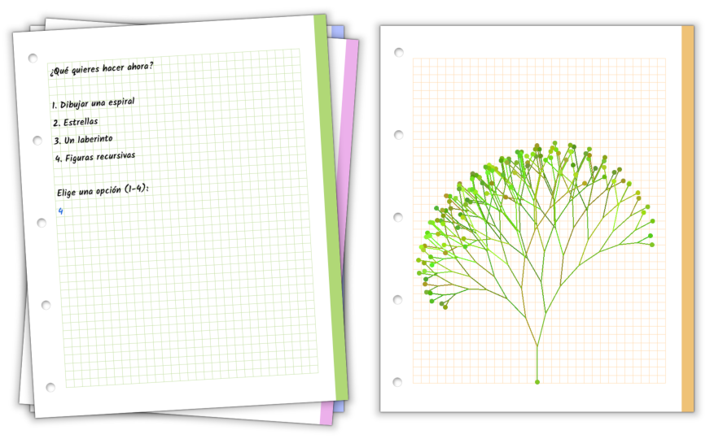

# Code Classroom

Plantilla de proyecto para [Godot Engine](https://godotengine.org/) pensado para enseñar los conceptos básicos de programación, sintaxis de GDScript, metodología de programación y algoritmos. Lo usamos en [Zenvoid Studio](https://games.zenvoid.org/) para jóvenes o personas que se adentran por primera vez en la programación informática. Incluye un caracol que está inspirado en la famosa tortuga del leguaje de programación LOGO.

---

**English**: Project template made with [Godot Engine](https://godotengine.org/) aimed at teaching basic programming concepts, GDScript syntax, programming methodology and algorithms. It's used by [Zenvoid Studio](https://games.zenvoid.org/) for young audiences and people who are entering for the first time into computer programming. Features a snail inpired by the famous turtle of the LOGO programming language.

